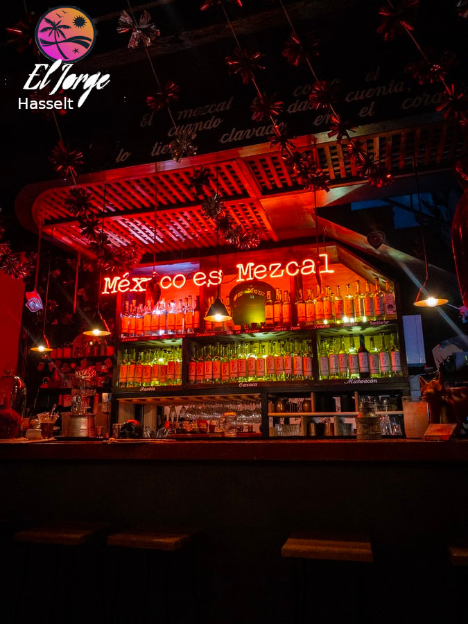

# restaurant-css-framework

## Creating the Welcome page
So I started with thinking about how I should structure the page according the rules of the challenge.

### The Language I used plus some attributes
* HTML5 and CSS3.
* Bootstrap.
* Responsive webdesigning.

### The source for using photos and logo
* https://unsplash.com
*  https://www.freepik.com
*  https://en.freelogodesign.org/
* I have modified them with Gimp for styling and added a self created logo wich I have also restyled.